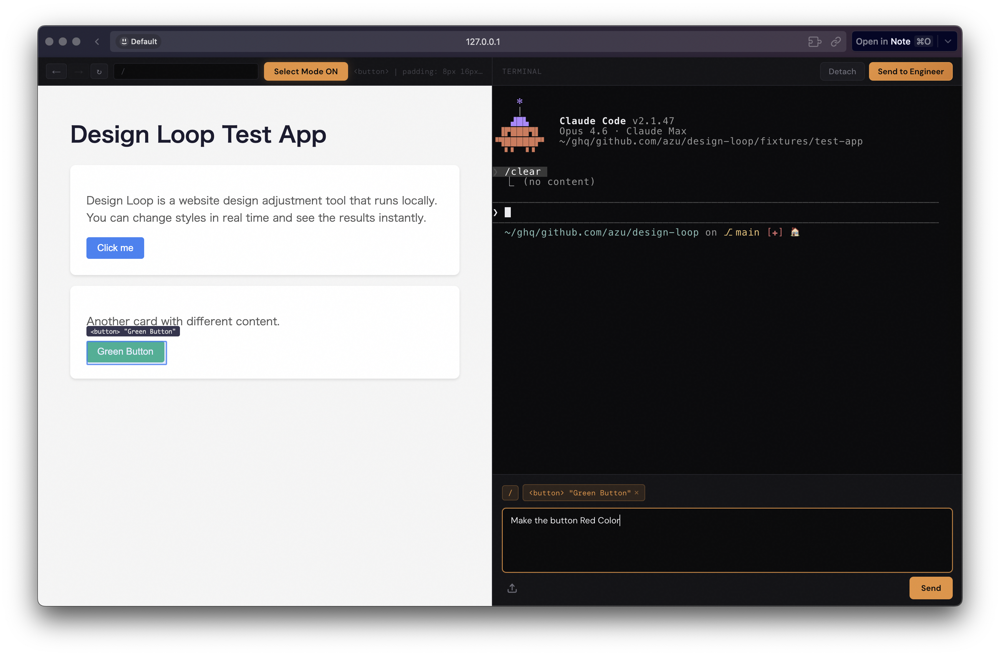

# design-loop

A design tool that lets designers directly edit websites through a visual UI.

Select elements on the page, describe changes in natural language, and [Claude Code](https://docs.anthropic.com/en/docs/claude-code) modifies the source code — no coding required.



## Features

- **Visual Element Selection** — Click any element on the page to select it. The tool detects React components, props, and source file locations automatically.
- **Natural Language Editing** — Describe design changes in plain text. Claude Code modifies the source code directly.
- **Live Preview** — See changes in real-time with hot reload support (HMR, SSE). Works with Next.js, Vite, and other dev servers.
- **Split Pane UI** — Resizable preview and terminal side by side. Drag the divider to adjust layout.
- **Picture-in-Picture** — Detach the terminal into a floating window (Chromium).
- **File Upload** — Drag-and-drop or paste images and files to include in design instructions.
- **Dev Server Proxy** — Transparent proxy that preserves HMR/WebSocket connections and injects the selection overlay.
- **Config File** — `.design-loop.json` for project-specific settings: dev server command, design tokens, and framework options.

## Prerequisites

- [Claude Code](https://docs.anthropic.com/en/docs/claude-code) CLI

## Install

Download binary from [GitHub Releases](https://github.com/azu/design-loop/releases/latest):

```bash
curl -fsSL https://raw.githubusercontent.com/azu/design-loop/main/install.sh | sh
```

Or manually:

```bash
mkdir -p ~/.local/bin
curl -fsSL "https://github.com/azu/design-loop/releases/latest/download/design-loop-$(uname -s | tr A-Z a-z)-$(uname -m | sed 's/aarch64/arm64/;s/x86_64/x64/')" -o ~/.local/bin/design-loop
chmod +x ~/.local/bin/design-loop
```

## Update

Update to the latest version with:

```bash
design-loop update
```


## Usage

Specify the URL of a running dev server to start design-loop.

### Connect to a running dev server

```bash
design-loop --url http://localhost:3000
```

### Auto-start a dev server

Use `--command` to let design-loop start the dev server automatically.

```bash
design-loop --url http://localhost:3000 --command "npm run dev"
```

### Monorepo

Use `--source` for the project root and `--app-dir` for the app directory.

```bash
design-loop --url http://localhost:3000 --source /path/to/monorepo --app-dir packages/web
```

### Config file

Place `.design-loop.json` in the project root to omit CLI options.

```json
{
  "devServer": {
    "url": "http://localhost:3000",
    "command": "npm run dev"
  }
}
```

```bash
design-loop
```

Additional config options (experimental — may break in future releases):

```json
{
  "devServer": {
    "url": "http://localhost:3000",
    "command": "npm run dev"
  },
  "context": {
    "files": ["src/theme.css", "src/tokens.ts"],
    "instructions": "Use existing design tokens and Tailwind utilities only"
  },
  "elementSelection": {
    "framework": "react",
    "ignoreSelectors": [".tooltip", ".overlay"]
  }
}
```

- `context.files` - Design token files to include as context for Claude
- `context.instructions` - Project-specific instructions for Claude
- `elementSelection.framework` - UI framework name (default: `"react"`)
- `elementSelection.ignoreSelectors` - CSS selectors to exclude from element selection

## Options

```
--url=<url>        Dev server URL (e.g. http://localhost:3000)
--command=<cmd>    Command to start dev server (e.g. "pnpm run dev")
--source=<path>    Path to source directory (default: ".")
--app-dir=<path>   App directory relative to source (for monorepo)
--port, -p <port>  UI server port (default: 5757)
--no-open          Skip opening browser automatically
--log-level <lvl>  Log level: debug, info, warn, error (default: info)
```

## Development

```bash
bun install
bun run dev
```

`bun run dev` starts both fixtures/test-app (port 3456) and the design-loop UI.

## License

MIT
